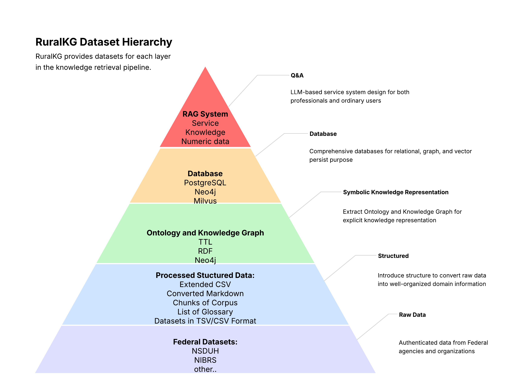

# RuralKG Dataset

RuralKG is a hierarchical dataset generated from multiple federal sources (e.g., NSDUH, NIBRS, TEDS-A/D) and focuses on substance abuse, mental health, and justice in rural areas. It provides a complete data processing pipeline—from raw data extraction to the deployment of a retrieval-augmented generation (RAG) system—making it a robust resource for researchers, practitioners, and educators.

## Project Overview

RuralKG’s layered architecture comprises several key stages:

1. **Extended CSV Generation:**  
   Raw data from federal codebooks (e.g., NSDUH) is processed into an extended CSV format, capturing rich, structured information.

2. **Ontology & Knowledge Graph Construction:**  
   The CSV data is used to build an ontology and a comprehensive knowledge graph that interconnects disparate data sources.

3. **Database Integration:**  
   Leveraging the knowledge graph, a relational database is constructed to manage both intermediate and final data effectively.

4. **RAG System Deployment:**  
   All the processed materials support a retrieval-augmented generation system, facilitating intelligent query responses and data exploration for both academic research and public service applications.

## Alpha Version Demo

An alpha version of the RuralKG Web Service is available at [RuralKG Web Service](http://52.170.155.134:8050/).

In this demo, you can explore:
- **Knowledge Queries:** Retrieve background information and insights about the dataset components.
- **Data Queries:** Access detailed data on substances and related metrics.
- **Service Queries:** Find mental health treatment facilities and other public service providers in rural areas.

Test cases and further documentation are available at [RuralKG Test Cases](data/test_case.csv).